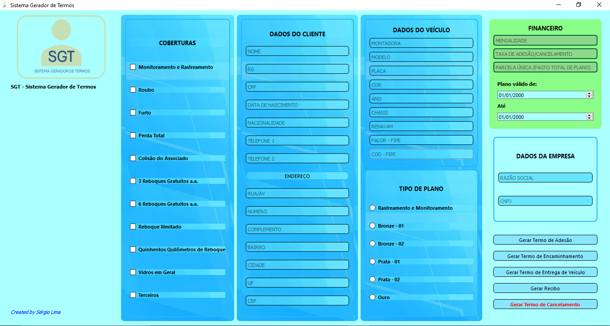
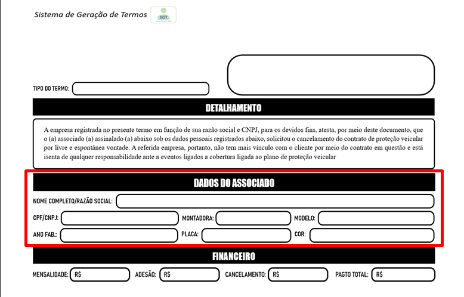
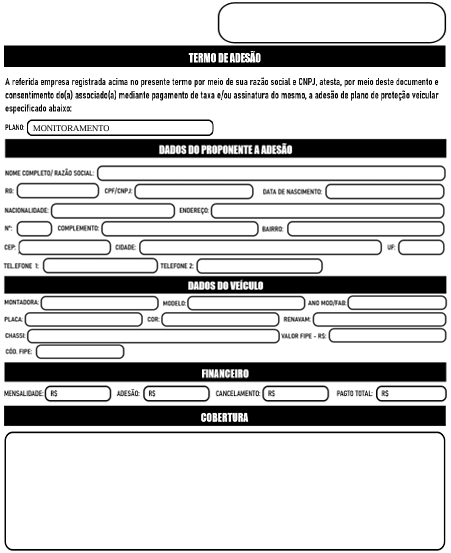
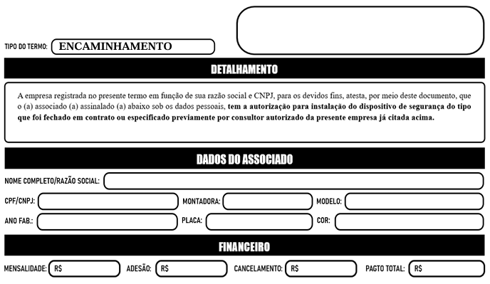
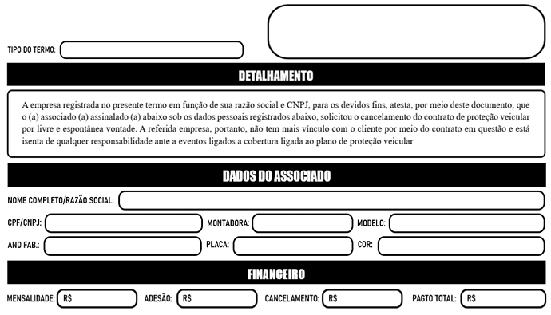

# Projeto | Sistema Gerador de Termos

 *Trata-se de um programa que gera algumas espécies de termos para empresas de proteção veicular.* 

##  PLANOS E SUAS COBERTURAS
#

Vale destacar que, por estar ainda em desenvolvimento, este programa de computador tem caráter restrito as características de operação da empresa na qual seu desenvolvedor trabalha. Especificamente, tal empresa trabalha com categorias de planos de proteção veicular que se diferenciam de acordo com as coberturas a eles atreladas . 

 Eis os nomes dos planos e suas coberturas:

| MONITORAMENTO   
-------------- 
Rastreamento
Monitoramento

| BRONZE 01   
-------------- 
Rastreamento
Monitoramento
Roubo
Furto
Três reboques gratuitos a.a.

| BRONZE 02   
-------------- 
Rastreamento
Monitoramento
Roubo
Furto
Três reboques gratuitos a.a.
Vidros em geral

| PRATA 01   
-------------- 
Rastreamento
Monitoramento
Roubo
Furto
Colisão
Seis reboques gratuitos a.a.
Reboque ilimitado por quebra
Quinhentos quilômetros de reboque

| PRATA 02   
-------------- 
Rastreamento
Monitoramento
Roubo
Furto
Colisão
Seis reboques gratuitos a.a.
Reboque ilimitado por quebra
Quinhentos quilômetros de reboque
Vidros em geral

| OURO    
-------------- 
Rastreamento
Monitoramento
Roubo
Furto
Colisão
Perda Total
Seis reboques gratuitos a.a.
Reboque ilimitado por quebra
Quinhentos quilômetros de reboque
Vidros em geral

##  TECNOLOGIAS UTILIZADAS
#
### _Linguagem de Programação_

A linguagem de programação utilizada é Python, na sua versão de número 3.11.5. A documentação está disponível [aqui](https://docs.python.org/3.11/).

### _Bibliotecas e Módulos_

| Biblioteca/Módulo | Versão | Documentação|
--------------------|--------|-------------|
PyQt5               | 5.15.2.|[PyQt5](https://doc.qt.io/qt-5.15/)
reportlab           |10.1.0  |[reportlab](https://docs.reportlab.com/)

##  LAYOUT PRINCIPAL
#
No presente momento, o aplicativo tem o seguinte layout principal, sem outras janelas para as funcionalidades, por enquanto:

Na coluna **COBERTURAS**, temos a opção, sob a forma de checkboxes, de seleção das coberturas de acordo com o TIPO DE PLANO. Futuramente será implementada a funcionalidade de preenchimento automático das coberturas de acordo com o plano.

A vantagem da seleção manual da cobertura estar disponível é que, em alguns casos, os clientes escolhem não ter alguma das coberturas que fazem parte de algum plano a fim de abater no valor da mensalidade. Por exemplo, um cliente pode optar por retirar a cobertura de perda total do seu plano Ouro.

Em seguida, temos a coluna **DADOS DO CLIENTE**. Aqui são colocados os dados do cliente  a fim de serem colocados no termo que desejar gerar ao final do cadastro.
#
### 👀 **Observação**
Cada tipo de termo possui seus campos nos quais nem todas as informações do cliente (dados pessoais ou do veículo) são usadas. O termo de cancelamento, por exemplo, não solicita os campos de endereço do cliente, conforme imagem abaixo:

Os detalhes sobre os dados que cada tipo de termo solicita serão passados na seção **TIPOS DE TERMOS**.
#
Na coluna **DADOS DO VEÍCULO**, como o próprio nome já diz, captamos o dados do veículo do cliente

Logo, mais abaixo temos o **TIPO DE PLANO**, dividido em seis modalidades cada um com suas coberturas. Os planos já foram abordados detalhadamente na seção **PLANOS E SUAS COBERTURAS** logo acima.

Em seguida, no canto superior direito temos o campo **FINANCEIRO** cuja finalidade é saber qual o valor da mensalidade do plano aderido, o valor da taxa de adesão (caso haja) ou de cancelamento (caso haja, em caso de cancelamento de contrato); e o valor da parcela única em caso de adesão a plano anual. Sobre este último campo, perceba que temos *dois widgets de input de data* para a seleção tanto do início do plano quanto da data final do mesmo.

Logo abaixo temos o campo **DADOS DA EMPRESA** os quais serão inseridos por padrão no início de cada termo, independente do tipo.

Por último e não menos importante, temos os botões para a geração dos termos de acordo com a necessidade. Na ordem temos:

|⏺ Botão| 📲 Funcionalidade
------|---------------
Gerar Termo de Adesão| Gera termo de adesão para qualquer dos tipos de planos
Gerar Termo de Encaminhamento| Gera termo de instalação/desinstalação (em caso de cancelamento) de dispositivo de segurança na autorizada para associados (as).
Gerar Termo de Entrega de Veículo| Gera termo que comprova a entrega de veículo após concerto em decorrência de acidente ou sinistro (porém, não se limita somente a estes dois casos).
Gerar Recibo| Em caso de recebimento, pelo associado (a), de valores de qualquer espécie, por qualquer forma de pagamento e em decorrência de qualquer serviço.
Gerar Termo de Cancelamento| Gera termo de cancelamento para associados (as) que desejam encerrar o contrato com a empresa, independente do tipo de plano.

##  TIPOS DE TERMOS
#
O Sistema Gerador de Termos elabora, de forma simples, quatro termos com base na biblioteca reportlab. Até o momento, o programa ainda não gera somente o **RECIBO** e o template para o TERMO DE ENTREGA DE VEÍCULO ainda está em construção, mas os restante dos termos são gerados normalmente.

 Cada um dos termos apresenta a descrição de seu tipo no campo **DETALHAMENTO**. Nele tem-se a especificação do caráter do termo.

 Como já foi supracitado de forma sucinta, existem quatro tipos de termos. A saber:

 - Adesão
 - Encaminhamento
 - Entrega de Veículo
 - Cancelamento 
#

O **Termo de Adesão**  possui o seguinte layout, conforme imagem abaixo:

   

 Como visto acima, o termo de adesão é o único que tem todos os campos para preenhcimento das informações oriundas das colunas **COBERTURA**,  **DADOS DO CLIENTE**, **DADOS DO ASSOCIADO** e **TIPO DE PLANO**. 
#

O **TERMO DE ENCAMINHAMENTO** tem o seguinte layout:

 

 Como visto na imagem, o termo de encaminhamento mostra, logo após a especificação no DETALHAMENTO, os seguintes campos que receberão os dados inseridos nos inputs das colunas: 

- Nome completo/Razão Social;
- CPF/CNPJ;
- Montadora;
- Modelo;
 - Ano;
 - Placa;
 - Cor.
 - Mensalidade;
 - Taxa de Adesão
 - Taxa de Cancelamento;
 - Pagamento Total.

O **TERMO DE CANCELAMENTO** tem o seguinte layout:

 

 O termo de cancelamento possui os mesmos campos do template PDF do termo de encaminhamento. 

##  ONDE OS ARQUIVOS EM PDF SÃO SALVOS
#
Quando qualquer dos botões para geração de algum termo ou, futuramente, recibo é pressionado, os arquivos gerados são salvos na pasta raíz onde o arquivo *main.py* está presente, enquanto não é implementada a funcionalidade de dar a liberdade ao usuário de salvar tais arquivos onde desejar. 

##  NOME DOS ARQUIVOS GERADOS
#
 Vale destacar que, quando gerados, os arquivos são nomeados da seguinte forma: **Nome do Associado(a) + tipo do termo**. Por exemplo, caso o associado esteja aderindo a quaisquer dos planos e clicar-se no botão Gerar Termo de Adesão, tal documento será criado sob o nome do associado seguido do tipo de termo (adesão, nesse caso).
